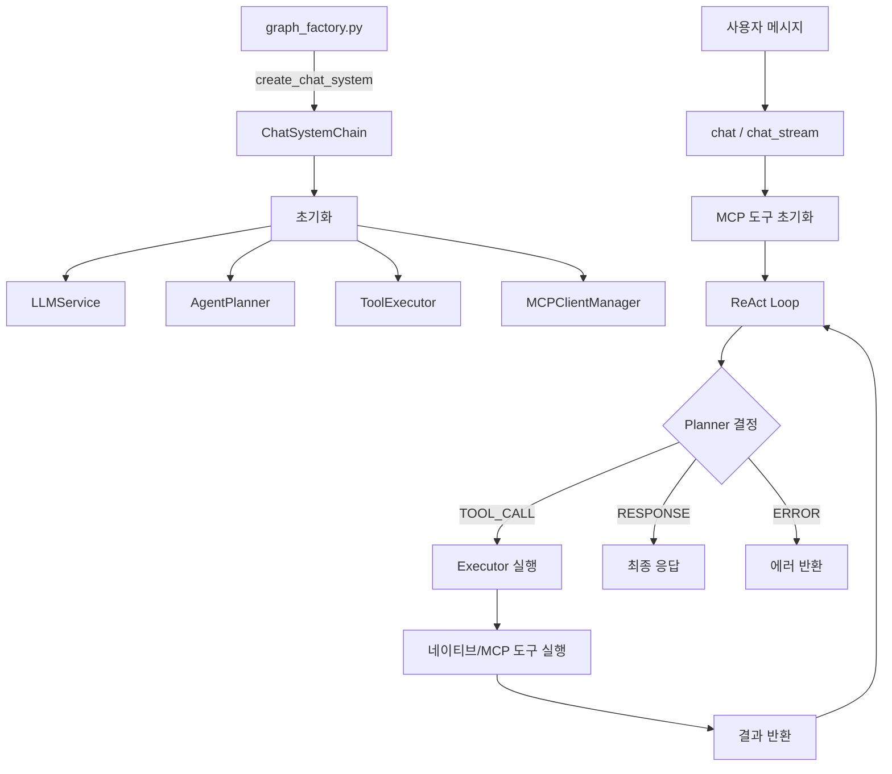
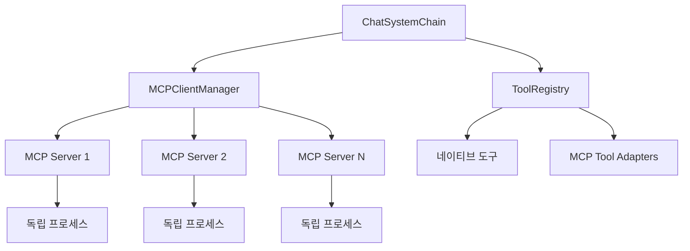

# Chat System

Agentic AI 기반의 대화 시스템으로, ReAct (Reasoning + Acting) 패턴과 MCP (Model Context Protocol)를 사용하여 도구를 활용한 지능형 응답을 생성합니다.

## 개요

Chat System은 사용자의 요청을 분석하고, 필요한 도구를 선택하여 실행한 후, 결과를 바탕으로 응답을 생성하는 Agentic AI 시스템입니다.

### 주요 특징
- **ReAct 패턴**: 추론(Reasoning)과 행동(Acting)을 반복하여 복잡한 작업 수행
- **MCP 기반 도구**: 오픈소스 MCP 서버를 활용한 고수준 도구 연동
- **확장 용이**: YAML 설정만으로 새로운 MCP 서버 추가 가능
- **스트리밍 지원**: 실시간 응답 스트리밍 가능

---

## 아키텍처

### 전체 흐름



### MCP 통합 아키텍처



---

## 폴더 구조 및 역할

```
chat/
├── __init__.py              # 모듈 진입점
├── chat_system_chain.py     # 메인 Chat 시스템
├── constants.py             # 상수 정의
├── README.md                # 문서
│
├── models/                  # 데이터 모델
│   ├── __init__.py
│   └── function_call_model.py
│
├── tools/                   # 네이티브 도구 (단순 유틸리티)
│   ├── __init__.py
│   ├── tool_registry.py     # 도구 레지스트리
│   └── report_formatter.py  # 보고서 포맷팅
│
├── mcp/                     # MCP 클라이언트
│   ├── __init__.py
│   ├── mcp_client.py        # MCP 클라이언트 관리자
│   ├── mcp_tool_adapter.py  # MCP→BaseTool 어댑터
│   └── mcp_config.py        # 설정 로더
│
├── agents/                  # 에이전트 컴포넌트
│   ├── __init__.py
│   ├── agent_planner.py     # 계획 수립 및 의사결정
│   └── tool_executor.py     # 도구 실행 관리
│
└── prompts/                 # 프롬프트 관리
    ├── __init__.py
    └── persona_loader.py    # 페르소나 로더
```

### 폴더별 상세 역할

| 폴더/파일 | 역할 | 주요 클래스/함수 |
|-----------|------|------------------|
| `chat_system_chain.py` | 메인 시스템, MCP 통합, ReAct 루프 | `ChatSystemChain`, `ChatConfig` |
| `constants.py` | 시스템 상수 및 기본 프롬프트 | `MAX_ITERATIONS`, `MCP_TOOL_PREFIX` |
| `models/` | 데이터 구조 및 타입 정의 | `AgentAction`, `ActionType`, `ToolDefinition` |
| `tools/` | 단순 네이티브 유틸리티 | `BaseTool`, `ToolRegistry`, `ReportFormatterTool` |
| `mcp/` | MCP 서버 연결 및 도구 관리 | `MCPClientManager`, `MCPToolAdapter` |
| `agents/` | 의사결정 및 실행 관리 | `AgentPlanner`, `ToolExecutor` |
| `prompts/` | 프롬프트 및 페르소나 관리 | `PersonaLoader`, `load_persona` |

---

## 핵심 컴포넌트

### ChatSystemChain

메인 시스템 클래스로, 전체 대화 흐름과 MCP 연동을 관리합니다.

```python
from systems.chat import ChatSystemChain, ChatConfig
from systems.chat.mcp import MCPServerConfig

# MCP 서버 설정
mcp_servers = [
    MCPServerConfig(
        name="filesystem",
        command="npx",
        args=["-y", "@modelcontextprotocol/server-filesystem", "/workspace"],
        timeout=30
    ),
    MCPServerConfig(
        name="fetch",
        command="npx",
        args=["-y", "@modelcontextprotocol/server-fetch"],
        timeout=45
    )
]

config = ChatConfig(
    model="gpt-4o",
    temperature=0.0,
    max_iterations=10,
    mcp_servers=mcp_servers
)

chat_system = ChatSystemChain(session_id="user-123", config=config)
response = await chat_system.chat("웹에서 데이터를 가져와서 분석해줘")
```

**주요 메서드**:
- `chat(message)`: 비동기 대화 처리
- `chat_stream(message)`: 스트리밍 대화 처리
- `cleanup()`: 리소스 정리 (MCP 연결 해제)
- `_initialize_mcp_tools()`: MCP 도구 초기화

### MCPClientManager

MCP 서버 연결을 관리하고 도구 호출을 처리합니다.

**주요 메서드**:
- `register_server(config)`: MCP 서버 등록
- `connect(server_name)`: 서버 연결
- `connect_all()`: 모든 등록된 서버에 연결
- `call_tool(tool_name, arguments)`: 도구 호출
- `disconnect_all()`: 모든 연결 해제

### MCPToolAdapter

MCP 도구를 BaseTool 형태로 변환하여 ToolRegistry에 등록합니다.

```python
from systems.chat.mcp import MCPToolAdapter

# MCP 도구를 BaseTool로 변환
adapter = MCPToolAdapter(
    mcp_manager=mcp_manager,
    server_name="filesystem",
    tool_info={
        "name": "read_file",
        "description": "파일 읽기",
        "inputSchema": {...}
    }
)

# ToolRegistry에 등록
ToolRegistry.register(adapter)
# 도구 이름: mcp_filesystem_read_file
```

### AgentPlanner

LLM을 사용하여 다음 액션을 결정합니다.

**반환 타입**: `AgentAction`
- `TOOL_CALL`: 도구 호출 필요
- `RESPONSE`: 최종 응답 생성
- `ERROR`: 에러 발생

### ToolExecutor

도구 실행을 관리하고 결과를 포맷팅합니다.

**제한 사항**:
- 최대 도구 호출 수: 20
- 타임아웃: 120초

---

## 도구 시스템

### 네이티브 도구 (단순 유틸리티)

| 도구 | 설명 |
|------|------|
| `report_formatter` | 분석 결과를 보고서 형식으로 포맷팅 |

### MCP 도구 (외부 서버)

MCP 서버를 통해 제공되는 도구들입니다. 설정 파일에서 활성화할 수 있습니다.

**추천 MCP 서버**:

| 서버 | 용도 | 명령어 |
|------|------|--------|
| filesystem | 파일 읽기/쓰기 | `npx -y @modelcontextprotocol/server-filesystem` |
| fetch | 웹 페이지/API 호출 | `npx -y @modelcontextprotocol/server-fetch` |
| sqlite | SQLite 데이터베이스 | `npx -y @modelcontextprotocol/server-sqlite` |
| postgres | PostgreSQL | `npx -y @modelcontextprotocol/server-postgres` |
| brave-search | 웹 검색 | `npx -y @modelcontextprotocol/server-brave-search` |
| github | GitHub API | `npx -y @modelcontextprotocol/server-github` |

MCP 도구는 `mcp_{server}_{tool}` 형식으로 자동 등록됩니다.
예: `mcp_filesystem_read_file`, `mcp_fetch_fetch`

---

## MCP 서버 설정

### 설정 파일 위치

`config/mcp_servers.yaml`

### 설정 예시

```yaml
servers:
  filesystem:
    command: "npx"
    args: ["-y", "@modelcontextprotocol/server-filesystem", "/workspace"]
    timeout: 30
    enabled: true

  fetch:
    command: "npx"
    args: ["-y", "@modelcontextprotocol/server-fetch"]
    timeout: 45
    enabled: true

  sqlite:
    command: "npx"
    args: ["-y", "@modelcontextprotocol/server-sqlite", "--db-path", "./data/database.db"]
    timeout: 30
    enabled: true

  custom_python:
    command: "python"
    args: ["-m", "my_mcp_server"]
    env:
      API_KEY: "your-api-key"
    timeout: 60
    enabled: true
```

### 설정 옵션

| 옵션 | 타입 | 설명 |
|------|------|------|
| `command` | string | 실행할 명령어 |
| `args` | list | 명령어 인자 |
| `env` | dict | 환경 변수 |
| `timeout` | float | 타임아웃 (초) |
| `enabled` | bool | 활성화 여부 |

---

## 확장 방법

### MCP 서버 추가

1. `config/mcp_servers.yaml`에 서버 설정 추가

```yaml
servers:
  my_server:
    command: "npx"
    args: ["-y", "@my-org/mcp-server-custom"]
    timeout: 30
    enabled: true
```

2. ChatConfig에서 설정 파일 경로 지정

```python
config = ChatConfig(
    mcp_config_path="config/mcp_servers.yaml"
)
```

### 직접 MCP 서버 지정

```python
from systems.chat.mcp import MCPServerConfig

config = ChatConfig(
    mcp_servers=[
        MCPServerConfig(
            name="my_server",
            command="python",
            args=["-m", "my_mcp_server"],
            timeout=60
        )
    ]
)
```

### 네이티브 도구 추가 (단순 유틸리티)

복잡한 분석 도구는 MCP로 구현하는 것을 권장합니다.
단순한 포맷팅/변환 도구만 네이티브로 추가하세요.

```python
from .tool_registry import BaseTool, ToolRegistry
from ..models.function_call_model import ToolDefinition, ToolParameter, ParameterType

class MyUtilityTool(BaseTool):
    name = "my_utility"
    description = "단순 유틸리티 도구"

    def get_definition(self) -> ToolDefinition:
        return ToolDefinition(
            name=self.name,
            description=self.description,
            parameters=[
                ToolParameter(
                    name="input",
                    type=ParameterType.STRING,
                    description="입력값",
                    required=True
                )
            ]
        )

    async def execute(self, input: str) -> dict:
        return {"result": input.upper()}

# 등록
ToolRegistry.register(MyUtilityTool())
```

---

## 설정 및 상수

### 주요 상수 (`constants.py`)

| 상수 | 기본값 | 설명 |
|------|--------|------|
| `MAX_ITERATIONS` | 10 | ReAct 루프 최대 반복 횟수 |
| `MAX_TOOL_CALLS` | 20 | 세션당 최대 도구 호출 수 |
| `TIMEOUT_SECONDS` | 120 | 도구 실행 타임아웃 (초) |
| `DEFAULT_MODEL` | "gpt-4o" | 기본 LLM 모델 |
| `DEFAULT_TEMPERATURE` | 0.0 | 기본 Temperature |
| `DEFAULT_TOOLS` | ["report_formatter"] | 기본 네이티브 도구 |
| `MCP_TOOL_PREFIX` | "mcp_" | MCP 도구 이름 접두사 |
| `MCP_DEFAULT_TIMEOUT` | 30.0 | MCP 기본 타임아웃 (초) |

### ChatConfig 옵션

```python
@dataclass
class ChatConfig:
    # LLM 설정
    model: str = "gpt-4o"
    temperature: float = 0.0

    # Agent 설정
    max_iterations: int = 10
    use_planning: bool = False

    # 도구 설정
    tools: List[str] = None  # 네이티브 도구 목록

    # MCP 설정
    mcp_servers: List[MCPServerConfig] = None  # MCP 서버 직접 지정
    mcp_config_path: str = None  # 설정 파일 경로

    # 페르소나
    persona: str = None
```

---

## 의존성

### 필수
- **mcp**: MCP Python SDK
- **LangChain**: LLM 통합
- **PyYAML**: 설정 파일 로드
- **Pydantic**: 데이터 검증

### 선택적 (MCP 서버에 따라)
- **Node.js/npx**: 공식 MCP 서버 실행

---

## 사용 예시

### 기본 사용 (설정 파일)

```python
from core.graph_factory import GraphFactory

# 설정 파일에서 MCP 서버 로드
chat_system = GraphFactory.create(
    "chat",
    session_id="user-123",
    mcp_config_path="config/mcp_servers.yaml"
)

# 대화
response = await chat_system.chat("현재 디렉토리의 파일 목록을 보여줘")
print(response)

# 리소스 정리
await chat_system.cleanup()
```

### 직접 MCP 서버 지정

```python
from systems.chat import ChatSystemChain, ChatConfig
from systems.chat.mcp import MCPServerConfig

config = ChatConfig(
    model="gpt-4o",
    mcp_servers=[
        MCPServerConfig(
            name="filesystem",
            command="npx",
            args=["-y", "@modelcontextprotocol/server-filesystem", "."]
        )
    ]
)

chat_system = ChatSystemChain(session_id="user-123", config=config)

try:
    response = await chat_system.chat("README.md 파일 내용을 읽어줘")
    print(response)
finally:
    await chat_system.cleanup()
```

### 스트리밍 사용

```python
async for chunk in chat_system.chat_stream("데이터를 분석하고 보고서를 작성해줘"):
    print(chunk, end="", flush=True)
```

### 컨텍스트 매니저 패턴

```python
class ChatSession:
    def __init__(self, session_id: str, **kwargs):
        self.chat_system = ChatSystemChain(session_id, **kwargs)

    async def __aenter__(self):
        return self.chat_system

    async def __aexit__(self, *args):
        await self.chat_system.cleanup()

# 사용
async with ChatSession("user-123", mcp_config_path="config/mcp_servers.yaml") as chat:
    response = await chat.chat("안녕하세요")
```

---

## 에러 처리

### MCP 관련 에러

```python
from systems.chat.mcp.mcp_client import (
    MCPError,
    MCPConnectionError,
    MCPTimeoutError,
    MCPToolNotFoundError
)

try:
    response = await chat_system.chat("...")
except MCPConnectionError as e:
    print(f"MCP 서버 연결 실패: {e}")
except MCPTimeoutError as e:
    print(f"MCP 도구 타임아웃: {e}")
except MCPToolNotFoundError as e:
    print(f"도구를 찾을 수 없음: {e}")
```

### 재시도 로직

MCPClientManager는 내장된 재시도 로직을 제공합니다:

```python
result = await mcp_manager.call_tool_safe(
    tool_name="read_file",
    arguments={"path": "/file.txt"},
    retries=3  # 최대 3번 재시도
)
```
